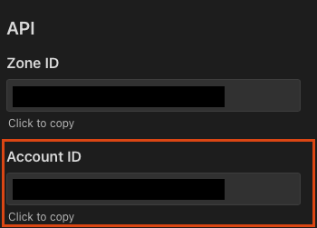

# DNSUP

#### Keep your DNS up-to-date!

## Install

Grab pre-built executables from [releases](releases/) or build from source:

```
$ git clone https://github.com/manojchandrashekar/dnsup.git
$ cargo build --release --locked
```

## Usage

This program should be executed (ideally, scheduled) on a device that exists on the network that resolves to the WAN IP that the domains must point to.

On the first run, if a config file is not found, a skeleton config will be created at: `~/.dnsup.toml`. If not, create it manually using the [template](.dnsup.toml).

Uses [TOML](https://toml.io/en/) formatting.

### Options

```
-v, --verbose       Show verbose output
-c, -config <file>  Specify config file location.
```

## Configuration

```
version = "1" # For handling changes in config structure

[lookup]
method = "dig"
provider = "opendns"

[cloudflare]
auth_token = "<auth-token>"
account_id = "<account-id>"
domains = "<comma-separated domain list>"

```

### Lookup

This instructs what method to use to fetch the WAN IP.

#### Available options:

```
method = "dig"
provider = "opendns"

This method uses the program `dig` to query myip.opendns.com to fetch the network IP.
```

### Cloudflare

This block holds the account information for accessing and editing DNS zones and records from the cloudflare account.

#### Available options:

`auth_token:` Create an authentication token in your [cloudflare account management](https://dash.cloudflare.com/profile/api-tokens) with `DNS:Edit` permissions for all the zones that you wish to update.

`account_id:` The account ID can be found at the domain overview page:


`domains:` Comma-separated domains that needs the A record to be updated.
